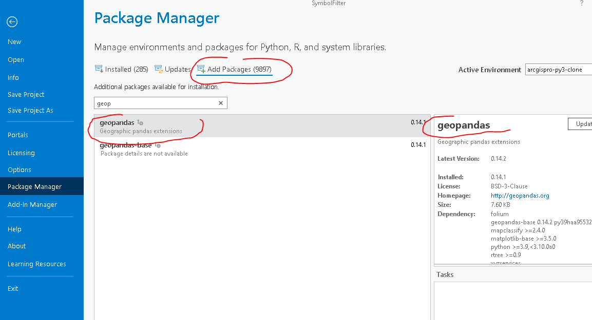
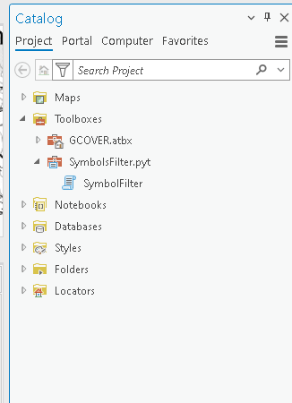
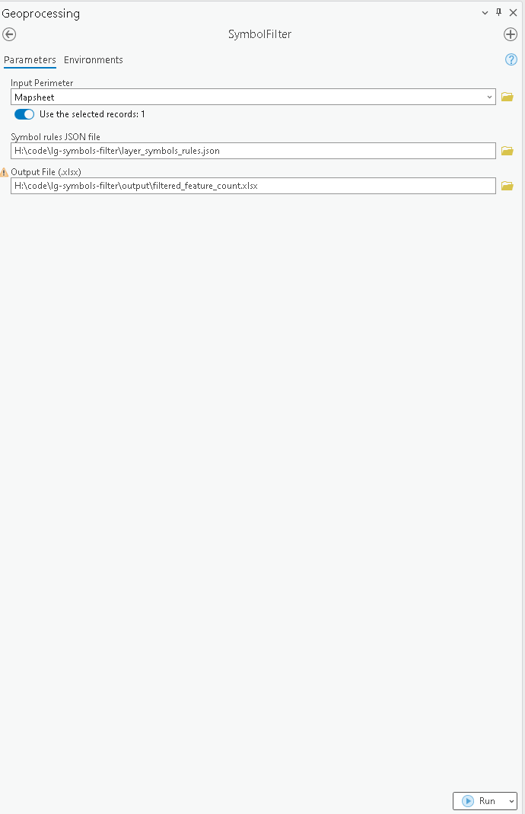
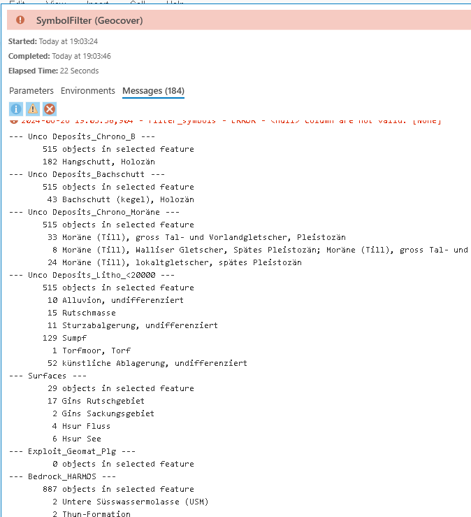

# ArcGis PRO (GOTOP) Symbols counter

ESRI ArcGis Pro Toolbox to filter symbols which are not currently not used in a given extent 
of Geocover

## Install

### Python environment and dependencies

This toolbox requires an additional Python module `geopandas` which must be installed
and the default `ArcGis Pro`conda environment cannot be modified.

Clone the default `arcgispro-py3` environment:

    Project > Package Manager. Install the environment on the D:\ drive for example D:\conda\envs\CLONE

Switch to this new environment and restart ArcGis Pro.

Add the missing geopandas package:

    Project > Package Manager > Add package

The environment is ready.

### Install python ToolBox

Download the code for the latest release from https://github.com/procrastinatio/lg-symbols-filter/releases and unzip the file in a directory accessible by ESRI ArcGis Pro.
In ArcGis, open the catalogue tab and add the SymbolsFilter.pyt file to the Toolboxes directory.
Only one tool exists: SymbolFilter

## Usage

Open or create an ArcGis Pro project with GeoCover layers (GOTOP - Production (.lyrx))
 
    \\v0t0020a.adr.admin.ch\lg\01_PRODUKTION\GIS\TOPGIS\NEPRO\GoTOP\Lyrx_P

Add the Mapsheet layer and select one of these polygons

Two input parameters:
The layer with the name of the layer containing the perimeter of interest (only one feature must be selected)
The file containing the symbol definitions (static for the moment)

Output
The name of the Excel file in which to write the results

Run with Run (at the bottom...)

